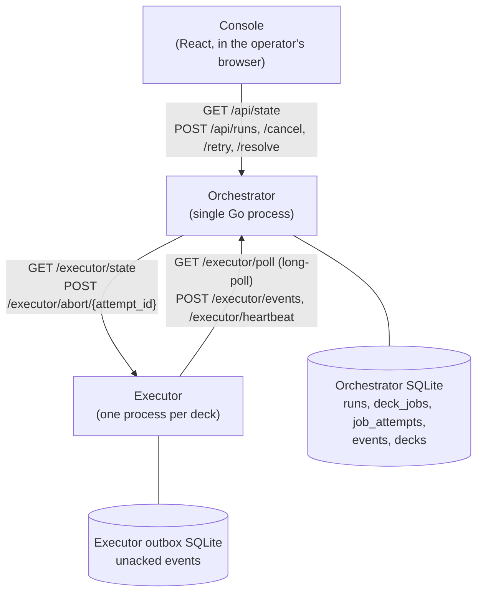
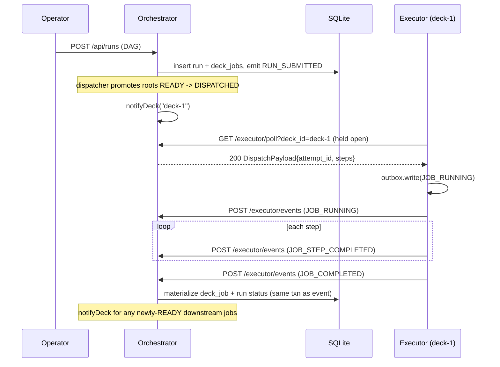

# DESIGN

## Architecture




Both the orchestrator and the executor host HTTP. Most traffic flows executor → orchestrator (pull dispatch, events, heartbeat); the orchestrator only dials the executor to probe a suspected-stuck attempt or signal an abort.

Three components:

- **Orchestrator.** One Go process. Owns authoritative state, hosts `/api/`* routes for operators. Runs one background loop (liveness) plus an inline transactional dispatcher and a reconciler driven by a liveness sweep:
  - dispatcher ([backend/internal/dispatch/dispatch.go](backend/internal/dispatch/dispatch.go)) — promotes `deck_job`s from `READY` to `DISPATCHED` inside the same tx as the caller (submit / retry / resolve / cancel / events / heartbeat / reconcile); `NotifyDeck` fires post transaction commit;
  - liveness monitor ([backend/internal/liveness/monitor.go](backend/internal/liveness/monitor.go)) — sweeps `decks.last_heartbeat_at` and `job_attempts.deadline_at` to flip `DeckHealth` and fire attempt deadlines;
  - reconciler ([backend/internal/reconciler/reconciler.go](backend/internal/reconciler/reconciler.go)) — when a deadline fires on a deck whose heartbeat isn't fresh, dials the executor to ask what's actually going on.
- **Executor.** One process per deck. Pulls work from `/executor/poll`, simulates the steps, ships state events to `/executor/events`. Also hosts `/executor/state` and `/executor/abort/{attempt_id}` so the orchestrator can probe and cancel it.
- **Console.** React SPA in the operator's browser. Consumes `/api/state`; mutates through `/api/`*.

In the demo all three run as local processes under a dev-only supervisor ([backend/internal/supervisor/process.go](backend/internal/supervisor/process.go)). In production they'd run on separate hosts; only HTTP routing changes.

Two SQLite databases, one per process boundary. The orchestrator DB is the authoritative store: `runs`, `deck_jobs`, `decks`, `job_attempts`, and the append-only `events` log all get written in the same transaction, so projections never disagree with the event that justified them. The per-executor outbox DB is a local buffer for at-least-once event delivery — events sit in the outbox until the orchestrator acks them, so a network blip or orchestrator restart can't silently drop them. Schemas: [backend/sql/orchestrator/0001_init.sql](backend/sql/orchestrator/0001_init.sql), [backend/sql/executor/0001_init.sql](backend/sql/executor/0001_init.sql).

### Data model


| Table               | Purpose                                                                                  | Key invariant                                                                                    |
| ------------------- | ---------------------------------------------------------------------------------------- | ------------------------------------------------------------------------------------------------ |
| `runs`              | One per DAG. `status`, `version` (optimistic), `terminal_at` only on COMPLETED/CANCELLED | `terminal_at` set ⇔ status ∈ {COMPLETED, CANCELLED}                                              |
| `deck_jobs`         | One per DAG node. `status`, `current_attempt_id`, `ambiguous_reason`, `version`          | Partial unique index: at most 1 row per `deck_id` in {DISPATCHED, RUNNING, AMBIGUOUS}            |
| `job_attempts`      | One per dispatch try. `outcome`, `outcome_source` (executor vs operator)                 | Outcome columns set together or not at all                                                       |
| `events`            | Immutable log. `(seq, kind, run_id, job_id, deck_id, attempt_id, payload)`               | Partial unique on `(attempt_id, kind)` — the dedupe key (per-step + conflict-log kinds excluded) |
| `decks`             | Slot table (size = `fleet_size`). `endpoint_url`, `last_heartbeat_at`, `health`          | Pre-allocated; `EMPTY` until first heartbeat                                                     |
| `outbox` (executor) | Events not yet acked by the orchestrator                                                 | At-least-once delivery anchor                                                                    |


### Happy path




## Communication model

### Pull dispatch (executor → orchestrator)

The executor pulls work via `GET /executor/poll?deck_id=...`, served by `(*ExecutorAPI).Poll` in [backend/internal/handlers/executor_poll.go](backend/internal/handlers/executor_poll.go).

Pull, not push. The orchestrator stays stateless about each executor's reachable address — the executor re-advertises its URL on every heartbeat, and that address can change across restarts. Pushing would have meant either tracking that address ourselves or paying for a queue (NATS, Redis, …); pull avoids both. The cost is polling latency, which the next section addresses.

### Long-poll with dispatcher-side notify

Short-poll on its own would burn ~1 idle req/s/deck forever. `Poll` instead holds the connection open for up to `poll_hold_max` (25s in demo, 2s in e2e), returning `204` only if it timed out empty.

Wakeups come from a per-deck notification broker at [backend/internal/dispatch/notify.go](backend/internal/dispatch/notify.go). The dispatcher loop ([backend/internal/dispatch/dispatch.go](backend/internal/dispatch/dispatch.go)) calls `notifyDeck(deck_id)` on every `READY → DISPATCHED` promotion. `Poll` subscribes to the per-deck channel *before* its first DB query — otherwise a dispatch landing between the query (missed it) and the subscribe (not listening yet) would only wake on the safety-net tick. That safety net is a 250ms re-query inside the long-poll loop, there for the case where a notify is genuinely dropped (broker entry GC'd between subscribe and notify); steady state doesn't depend on it.

Steady-state idle cost per deck: one held connection, zero req/s. The naive short-poll alternative would have burned ~1 idle req/s/deck — at fleet=100 that's 100 req/s of pure "nothing for me?" traffic, which the wire captures made obvious.

### Liveness (heartbeat + reconciler probe)

Executors `POST /executor/heartbeat` every 2 s (250 ms in e2e). The liveness monitor runs two scans:

1. **Heartbeat age.** `decks.health` flips `HEALTHY → STALE` once heartbeat age exceeds `stale_threshold`, and `STALE → UNREACHABLE` if the stale window compounds with a failed probe. UNREACHABLE stops new dispatch until heartbeats return.
2. **Attempt deadline.** Every `job_attempts` row carries a deadline (`attempt_deadline_base + attempt_deadline_per_step × steps`). When it fires and the deck's heartbeat isn't fresh, the attempt goes to the reconciler instead of flipping straight to AMBIGUOUS.

The reconciler dials `GET /executor/state?attempt_id=...`. The executor answers with an `ExecutorAttemptState` of `RECEIVED`, `IN_PROGRESS`, `COMPLETED`, or `FAILED`, or the probe itself fails (TCP error, timeout). The reconciler buckets the outcome — `applied`, `running`, `no_change`, `ambiguous`, `unreachable`, `no_dispatch` — and that bucket decides the next move: advance the projection if the executor handed us a terminal answer, hold if it's still genuinely running, escalate to AMBIGUOUS if we asked and we still don't know. That decision matrix is the load-bearing piece of recovery logic — it's the difference between "deck stayed silent and we waited" and "deck stayed silent and we made the operator decide."

### At-least-once events, idempotent on `(attempt_id, kind)`

Every state change the executor makes hits the outbox first, then ships to `POST /executor/events`. Failed shipments stay queued and retry on backoff. The orchestrator's `events` table has a partial `UNIQUE(attempt_id, kind)` index (per-step + conflict-log kinds excluded), and the handler returns one of three 2xx shapes (all 2xx so the executor's outbox stops retrying either way):

- `ExecutorEventApplied` — first time we've seen this `(attempt_id, kind)`. Projection updates ride the same transaction as the event insert; a reader can never see one without the other.
- `ExecutorEventDuplicate` — same key, same outcome. Silent no-op. Expected after orchestrator restart (executor flushes anything that wasn't acked), and after any network blip that caused the executor to retry a ship that actually landed.
- `ExecutorEventConflictLogged` — same key, *different* outcome (e.g. operator resolved to FAILED while the executor was reporting COMPLETED), or the `deck_job` is now CANCELLED. An `EXECUTOR_CONFLICT_LOGGED` event is appended for forensics; no projection change; executor stops retrying. Auto-resolution is out of scope per the prompt.

Crash-restart correctness falls out of this directly. Anything in the outbox at crash time gets re-shipped; if the original ship never landed, the orchestrator applies it now; if it did land but the executor never saw the ack, the orchestrator no-ops it. No physical work silently lost, no projection double-applied.

## State machines

Three enums carry the system's state, at three different grains. `RunStatus` is what the operator looks at for the DAG as a whole; it's materialized from the per-job `DeckJobStatus`es. `DeckJobStatus` is the per-node lifecycle, including the two non-happy resting states (FAILED, AMBIGUOUS) that wait on an operator decision. `DeckHealth` is independent of any run — it's the orchestrator's view of whether the executor at a given slot is reachable right now, and it gates dispatch.

`RunStatus`:


| Status      | Terminal? | Notes                                                    |
| ----------- | --------- | -------------------------------------------------------- |
| `PENDING`   | no        | Submitted, dispatcher hasn't picked it up                |
| `RUNNING`   | no        | At least one `deck_job` past PENDING                     |
| `COMPLETED` | yes       | Every `deck_job` is COMPLETED                            |
| `FAILED`    | no        | At least one `deck_job` FAILED; awaiting retry or cancel |
| `AMBIGUOUS` | no        | At least one `deck_job` AMBIGUOUS; awaiting resolve      |
| `CANCELLED` | yes       | Operator cut the run                                     |


`DeckJobStatus`:

```
PENDING -> READY -> DISPATCHED -> RUNNING -> COMPLETED
                                          -> FAILED      (retry-able)
                                          -> AMBIGUOUS   (resolve-able)
                                          -> CANCELLED
```

`DeckHealth` (`EMPTY` / `HEALTHY` / `STALE` / `UNREACHABLE`): STALE triggers a probe; UNREACHABLE stops new dispatch until heartbeats return.

### FAILED vs AMBIGUOUS

FAILED is the executor telling us the attempt failed. The failure is observed, the physical state is whatever the failure left behind, and a retry is genuinely new work.

AMBIGUOUS is "we don't know." Heartbeat went silent past the deadline, or `/executor/state` came back `IN_PROGRESS` past the ceiling, or the probe never landed. Retrying here risks duplicate physical work — the unstuck executor might still complete the original attempt — so the attempt sits AMBIGUOUS until the operator declares the physical outcome.

Both leave the run non-terminal (`terminal_at` null) so the operator's options stay open until they make the call.

## Ambiguity resolution

The run-detail page surfaces every AMBIGUOUS `deck_job` with its `ambiguous_reason` (`DEADLINE_ELAPSED`, `EXECUTOR_REPORTED_UNKNOWN`, `DEADLINE_EXCEEDED`) and the last executor-reported state. The operator declares the physical outcome via `POST /api/runs/{id}/jobs/{job_id}/resolve` with `{resolution, operator_note, expected_version}`. The orchestrator writes the attempt's `outcome` with `outcome_source = OPERATOR_RESOLUTION`, releases the deck slot, and on FAILED fires a best-effort `POST /executor/abort/{attempt_id}` so a still-alive executor can't repeat the work (COMPLETED skips the abort — the operator already accepted that the work happened). COMPLETED promotes downstream jobs to READY; FAILED parks the run in `RunStatus.FAILED` for retry or cancel.

## Two operators acting at once

Every mutation that can race carries an `expected_version`. The handler compares it to the current row in the same transaction that would write the change. Mismatch → HTTP 409 `VERSION_MISMATCH`, with `details.current_state` set to the up-to-date row (schema in [api/openapi.yaml](api/openapi.yaml) → `VersionMismatchError`). The console catches the 409 inside the open modal, refreshes the cached view, and asks the operator to re-confirm against the new state. At most one of two simultaneous Cancel clicks lands; the loser sees "state moved, please confirm again" once.

## Orchestrator restart

```mermaid
sequenceDiagram
  participant Op as Operator
  participant Sup as Supervisor
  participant Orch as Orchestrator
  participant DB as SQLite
  participant Exec as Executor

  Op->>Orch: POST /api/admin/restart
  Orch-->>Op: 202 {"status":"restarting"}
  Orch->>Orch: drain in-flight HTTP, exit
  Sup->>Orch: respawn (within respawn_delay)
  Orch->>DB: open WAL; read materialized rows as-is
  Note over Orch: dispatcher re-evaluates READY jobs;\nnotifyDeck for any pending work
  Note over Exec: kept running through the gap
  Exec->>Orch: POST /executor/events (catch-up from outbox)
  Orch->>DB: dedupe on (attempt_id, kind); apply new ones
```


No event replay. `runs / deck_jobs / decks` are durable, written in the same transaction as the `events` row that justified the change, so the post-restart projection is already correct. Recovery is open-the-DB, restart the loops, accept the outbox catch-up. If the gap exceeded an attempt deadline the reconciler picks up the AMBIGUOUS path on the next sweep — same as any other deadline elapse.

## Failure handling


| Failure                                                   | Detection                                                                          | Recovery                                                                                                                                                         | Operator-visible outcome                                         |
| --------------------------------------------------------- | ---------------------------------------------------------------------------------- | ---------------------------------------------------------------------------------------------------------------------------------------------------------------- | ---------------------------------------------------------------- |
| Orchestrator restart                                      | Process exit (SIGTERM, panic, `/api/admin/restart`)                                | Supervisor respawns; orchestrator reads materialized rows; executors flush outbox; dispatcher re-evaluates READY jobs                                            | Console flashes `DEGRADED_MODE` for ~1–2 s; no run lost          |
| Network flake (either direction)                          | Egress: heartbeat ages past `stale_threshold`. Ingress: probe/abort dials fail     | Reconciler probes `/executor/state`; in-flight attempt continues on the executor, reports when the link heals. Deck health flips `HEALTHY → STALE → UNREACHABLE` | Self-recovers if link heals before deadline; otherwise AMBIGUOUS |
| Executor hang mid-step                                    | Heartbeat continues (worker hung, not process); attempt deadline fires             | `deck_job` → AMBIGUOUS, `reason=DEADLINE_ELAPSED`; best-effort `/executor/abort/{attempt_id}`                                                                    | Resolve modal                                                    |
| Executor crash (`os.Exit`)                                | Heartbeat stops; supervisor sees child exit                                        | Supervisor respawns; reborn executor runs outbox flusher + worker in parallel; orchestrator dedupes on `(attempt_id, kind)`                                      | Self-recovers if respawn beats deadline; otherwise AMBIGUOUS     |
| Delivery anomalies (duplicate event, replay, lost outbox) | Dedupe key match → `ExecutorEventDuplicate`; outbox load failure on executor start | Duplicates are silent no-ops. A genuinely lost outbox means we have no proof of what happened — surfaces as AMBIGUOUS rather than blind retry                    | Invisible (duplicates) or resolve modal (lost outbox)            |
| Two operators act simultaneously                          | `expected_version` mismatch → 409 `VERSION_MISMATCH`                               | Modal re-fetches and re-confirms against fresh state                                                                                                             | One operator sees "state moved, please confirm again"            |


Two failure modes I'm deferring with a plan, not handling today (see Deferred): reconciler probe storm when a lot of decks go silent at once, and SQLite write contention above ~1000 decks.

## Frontend (operator-visible behavior)

Implementation lives under [frontend/src/lib/live/use-live-state.ts](frontend/src/lib/live/use-live-state.ts) and [frontend/src/lib/connection/](frontend/src/lib/connection/). What the operator actually sees:

- **Live updates, no reloads.** Single global 1 Hz poll against `/api/state`; events drive per-row reducers, `decks_delta` merges into the decks cache. Run-detail mounts a dedicated 1 Hz `/api/runs/{id}/state` bootstrap so a fresh page load doesn't wait on the global rebootstrap floor. The global hook owns event reducers (single-writer rule, see [frontend/src/lib/live/use-live-run-state.ts](frontend/src/lib/live/use-live-run-state.ts)); this hook is bootstrap-only.
- **Stuck step or silent deck.** Deck's health pill flips `HEALTHY → STALE → UNREACHABLE` in the fleet view; affected job shows "last heartbeat Xs ago" inline. If the deadline fires, the run-detail "Needs your attention" panel surfaces it for resolve.
- **Connection trouble.** Banner shows `OFFLINE` / `LIVE_PAUSED` / `DEGRADED_MODE`. The same state drives an operator gate that disables mutation buttons — without that gate, the banner's "actions disabled" copy was a lie.
- **Action rejected because state moved.** 409 `VERSION_MISMATCH` is caught inside the open modal; the modal re-renders against the freshest snapshot and asks the operator to re-confirm. Their note and checkbox state are preserved.
- **Forgotten tab.** Polling is visibility-gated; a hidden tab issues 0 req/s and fires a catch-up tick on `visibilitychange`.

## Performance

Three measurement passes feed this section, all reproducible from `analysis/` (see [analysis/README.md](analysis/README.md)).

### What we measured and how

- **Wire capture** ([analysis/wire/](analysis/wire/)) — boots a real 4-deck stack and exercises the API, while the orchestrator's logging middleware ([backend/internal/api/mw_logging.go](backend/internal/api/mw_logging.go)) emits per-request NDJSON that rolls up by route (counts, status mix, latency, bytes).
- **Console capture** ([analysis/console/](analysis/console/)) — six Playwright scenarios (steady-state, event-burst, reconnect, multi-tab, long-lived, hundred-deck-fleet) record HAR + trace + heap against the real React app.
- **Scale sweep** ([analysis/scale/](analysis/scale/)) — an async Python loadgen impersonates N executors against a bare orchestrator, sweeping `N ∈ {10, 100, 1000}` and capturing latency, memory, DB growth, and DAG completion per N.

A static-scan layer ([analysis/inefficiencies/](analysis/inefficiencies/)) consumes all three corpora and produces the prioritized findings list in [analysis/inefficiencies/inefficiencies.md](analysis/inefficiencies/inefficiencies.md). Full reproduction in [analysis/README.md](analysis/README.md).

### Results

Scale sweep ([analysis/scale/runs/breaking-point.md](analysis/scale/runs/breaking-point.md)) — single orchestrator, synthetic loadgen as executors, 120s steady-state per N:


| N decks      | RSS peak | p95 `/executor/events` | Completion                      |
| ------------ | -------- | ---------------------- | ------------------------------- |
| 10           | 40 MiB   | 1.3 ms                 | 3/3 COMPLETED                   |
| 100 (target) | 49 MiB   | 17 ms                  | 33/33 COMPLETED                 |
| 1000         | 115 MiB  | 45 ms                  | 299/333 COMPLETED, 34 AMBIGUOUS |


Comfortable at the prompt's 100-deck target. The wall above ~1000 is SQLite write contention on a single connection — `/executor/events` p99 grew 434× between N=10 and N=5000, queue-shaped not CPU-shaped. Postgres / split read+write is in Deferred.

### What we changed

- **Long-poll `/executor/poll` with dispatcher notify** (wire capture showed 87% of polls returned 204) — idle traffic per deck drops to 1 held connection, 0 req/s; dispatch latency drops to near-zero.
- **`decks_delta` on `/api/state` delta polls** (full `decks[]` was shipping every tick regardless of activity) — steady-state heartbeat slice scales with activity, not fleet size.
- **gzip response middleware** (no `Content-Encoding` was advertised) — bodies above 1 KiB compressed; small bodies pass through.
- **Console visibility gating** (hidden tab kept polling at 1 Hz) — hidden tab issues 0 req/s, catch-up tick on `visibilitychange`.

The big remaining wall — single SQLite write connection at fleet > ~1000 — needs Postgres or split read/write paths; that's in Deferred and the analysis toolkit can re-measure it without changes once the migration lands.

## Trade-offs


| Decision       | Chose                                      | Alternative                         | Why                                                                                                             |
| -------------- | ------------------------------------------ | ----------------------------------- | --------------------------------------------------------------------------------------------------------------- |
| Real-time wire | Long-poll                                  | SSE / WebSocket                     | Plain HTTP middleware, no sticky-routing across restart. Cost: one held TCP per deck.                           |
| Persistence    | SQLite (WAL)                               | Postgres                            | Single-binary demo, no infra dependency. Scale wall, see above.                                                 |
| Dispatch       | Pull + notify                              | Push / external queue (NATS, Redis) | Pull keeps the executor stateless about its address; notify reclaims the latency cost without adding a service. |
| Delivery       | Per-attempt outbox + dedupe                | Best-effort fire-and-forget         | Required by "no silent loss of physical work."                                                                  |
| Concurrency    | Optimistic version on `runs` + `deck_jobs` | Server-side locking                 | Two-operator race becomes a clean 409 instead of a hung request.                                                |


## Deferred — with a plan

- **Postgres / split read+write paths.** Required above ~1000 decks. Schema and sqlc queries are portable; migration is mechanical. The materialized-projection + events split survives the move.
- **Reconciler probe rate limit / circuit breaker.** Fine at fleet=100; needed before fleet=1000, where N silent decks ⇒ N concurrent probes today. Bounded per-deck queue with a global concurrency cap.
- **Operator auth + per-user identity.** Out of scope per the prompt. When added: identity-stamp every mutation; the existing event log carries it for free.
- **Run history pagination / archival.** `/api/runs` returns the last 50 today. Cursor pagination + cold-storage rotation once the events table outgrows working set.
- **Cross-tab coalescing on the console** (`BroadcastChannel`). Minor win past two open tabs; not worth the complexity until it shows up in the wild.
- **Bootstrap N+1 collapse.** `/api/state` bootstrap currently does per-row sub-queries via `rowToDeck` / `rowToRunSummary` (S11 in `analysis/inefficiencies/`). Fold into one LEFT JOIN'd read per resource so the first poll of a new tab is a single query instead of scaling with fleet + recent runs.

